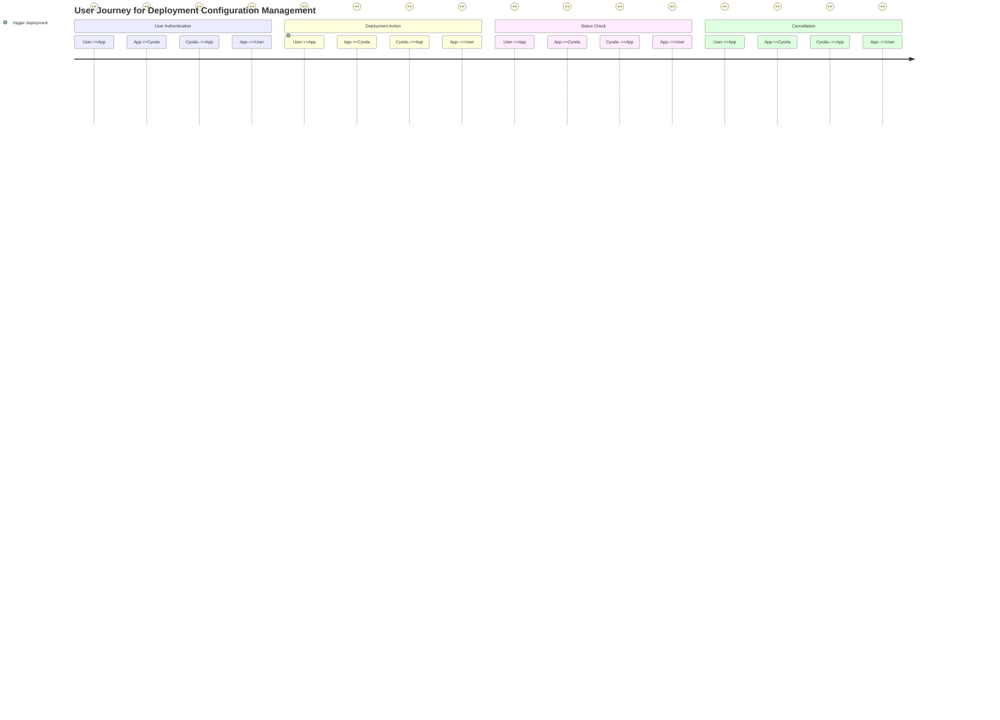
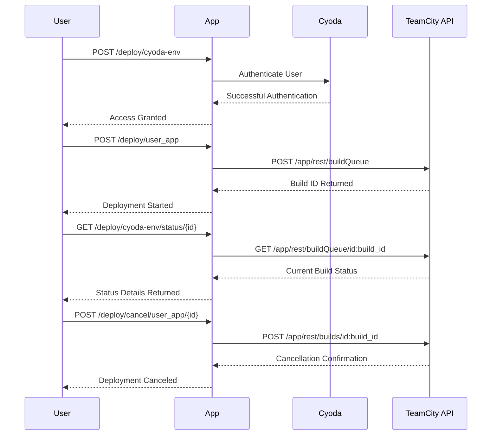

### User Requirement Document for Cyoda-like Application: Deployment and Environment Configuration Management

---

#### Overview
The goal of this application is to provide a management system for deployments and environment configurations tailored for multiple users. The application will facilitate user authentication, initiate builds in TeamCity, and retrieve the status and statistics of these builds. All actions will be encapsulated within a RESTful API architecture.

---

### User Stories

#### User Story 1: User Authentication
**As a** user,  
**I want** to authenticate using a Bearer token,  
**So that** I can access the deployment and environment API endpoints.

#### User Story 2: Deploy Environment Configuration
**As a** user,  
**I want** to trigger environment configuration deployment via an API call,  
**So that** my configurations can be applied to the deployment pipeline.

#### User Story 3: Retrieve Deployment Status
**As a** user,  
**I want** to check the status of my deployment using a specific ID,  
**So that** I can monitor the progress of my build.

#### User Story 4: Cancel Deployment
**As a** user,  
**I want** to cancel a running or queued deployment,  
**So that** I can free up resources or correct configurations.

---

### User Journey Diagram

---

### Sequence Diagram

---

### Explanation of Choices:

1. **Sequence and Journey Diagrams**: These diagrams visually represent the various interactions between users, the application, Cyoda, and the TeamCity API. This helps to clarify the flow of actions and the steps taken by the user to accomplish their goals in the application.

2. **User-Centric Format**: The user stories are written in an "As a [user role], I want [goal] so that [reason]" format. This makes it easy to understand what features are necessary and why they matter to the end-users.

3. **RESTful API Compliance**: The API functions included (e.g., POST, GET) follow RESTful standards, ensuring structural consistency and clarity about the operations available to users.

This user requirement document offers a clear roadmap for the development of a Cyoda-like application, aligning business needs with user expectations and ensuring comprehensive functionality in deployment management.