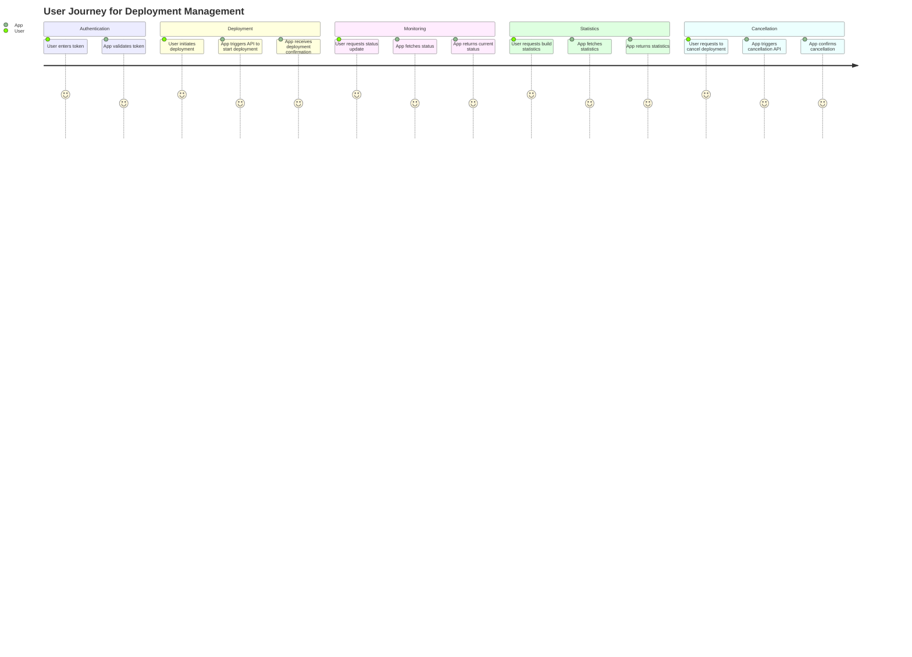
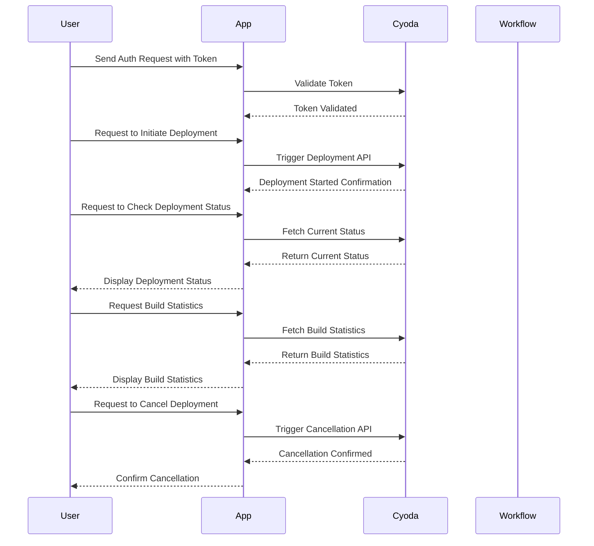

### User Requirement Document

#### Title: Multi-User Deployment and Environment Configuration Management App

### User Stories

1. **User Story 1**: As a user, I want to authenticate via a token so that I can securely access the deployment functionalities of the application.
  
2. **User Story 2**: As a user, I want to initiate a deployment by providing the necessary configuration options, so that the application can deploy my environment.

3. **User Story 3**: As a user, I want to check the status of my deployments, so that I can monitor their progress and determine if any action is needed.

4. **User Story 4**: As a user, I want to retrieve the build statistics for my deployments, so that I can analyze the performance and success rates of my builds.

5. **User Story 5**: As a user, I want to cancel a queued deployment if necessary, so that I can manage my deployments efficiently.

---

### Journey Diagram

---

### Sequence Diagram

---

### Explanation of Choices

1. **User Stories**: These stories capture the specific needs and functionalities that the users will interact with, ensuring that all key aspects of the application are addressed.

2. **Journey Diagram**: This diagram illustrates the steps a user will follow while interacting with the application, from authentication to initiating deployments and monitoring their status. It captures the flow of activities clearly.

3. **Sequence Diagram**: The sequence diagram details the interactions between the user, the application, and the Cyoda system, showing how requests and responses flow between them. This helps in visualizing how the components interact in real-time when actions are performed, ensuring clarity in understanding the process.

Overall, these diagrams and documents will serve as a comprehensive guide for the development and implementation of the application, aligning with Cyoda's architecture and ensuring that user needs are effectively met.