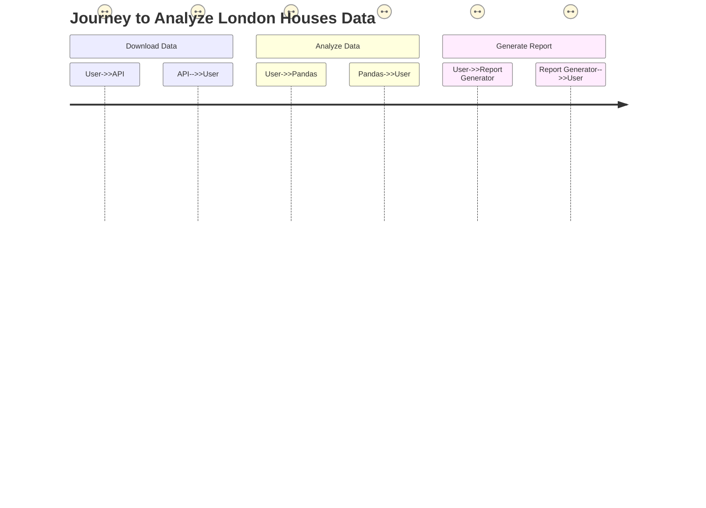
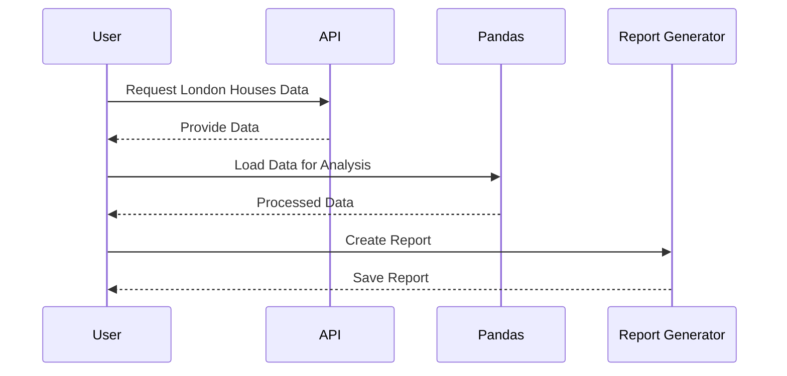

Hey there! 😊 I see that you want me to validate your requirement and create a user requirement document that includes user stories, a journey diagram, and a sequence diagram. I'm excited to help you with this!

### Understanding Your Requirement
You want to download data related to London houses, analyze it using pandas, and save a report. This entails not just fetching the data but also processing it effectively and generating a summary report for your analysis. This is a great initiative, and I want to ensure we capture all the necessary details to make it a success!

### User Requirement Document
I'll create a structured document in markdown format that includes:

1. **User Stories**: These will describe what you, as the user, want to achieve with this project.
2. **Journey Diagram**: This will visualize the steps you take from downloading the data to saving the report.
3. **Sequence Diagram**: This will illustrate the interactions between different components during the process.

Let me put this together for you! I'll start with the user stories and then create the diagrams. Here we go:

```markdown
# User Requirement Document

## User Stories

### User Story 1
**As a user**, I want to download information about London houses so that I can analyze the real estate market in that area.

### User Story 2
**As a user**, I want to use pandas to perform data analysis on the downloaded London houses data so that I can gain insights and understand trends.

### User Story 3
**As a user**, I want to generate a report summarizing the analysis of the London houses data, so I can share my findings with others.

## Journey Diagram


## Sequence Diagram


### Explanation of Choices
- **User Stories**: I focused on clearly outlining what you want to achieve, breaking it down into specific goals that capture the essence of the project. This helps in understanding user needs and guiding development.
- **Journey Diagram**: This visualizes the steps you take throughout the process, making it easy to see how you interact with the different components from downloading data to generating a report.
- **Sequence Diagram**: This diagram illustrates the interactions between you and the system components, showing how data flows and how tasks are completed in a logical order.

If there's anything you'd like to adjust or if you have more ideas to add, just let me know! I'm here to help and make sure we get everything right for your project. 😊