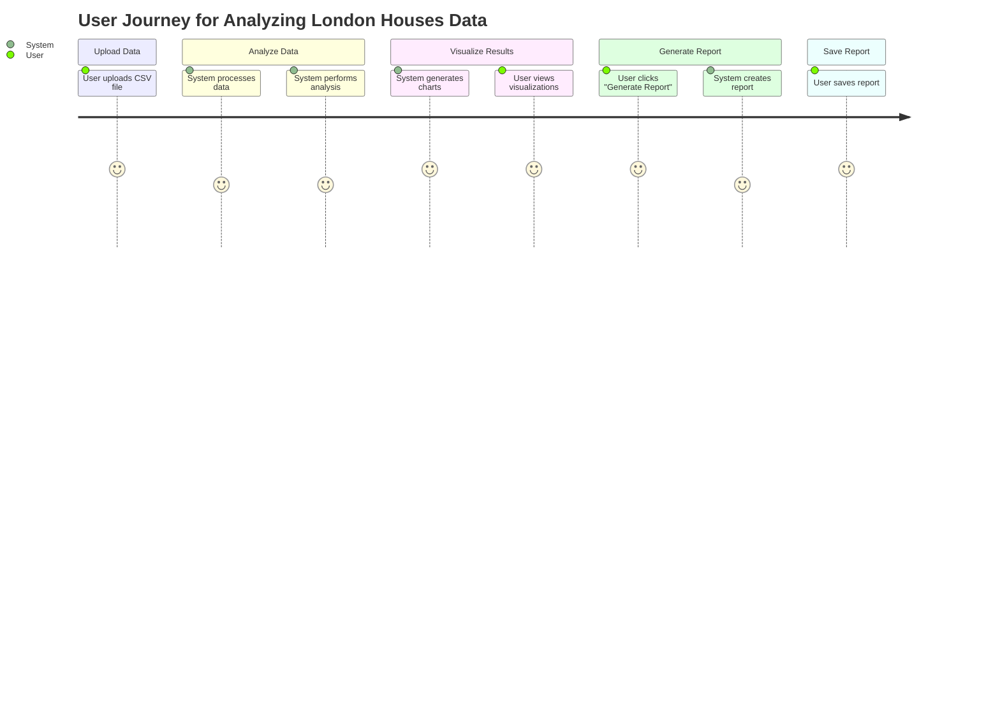
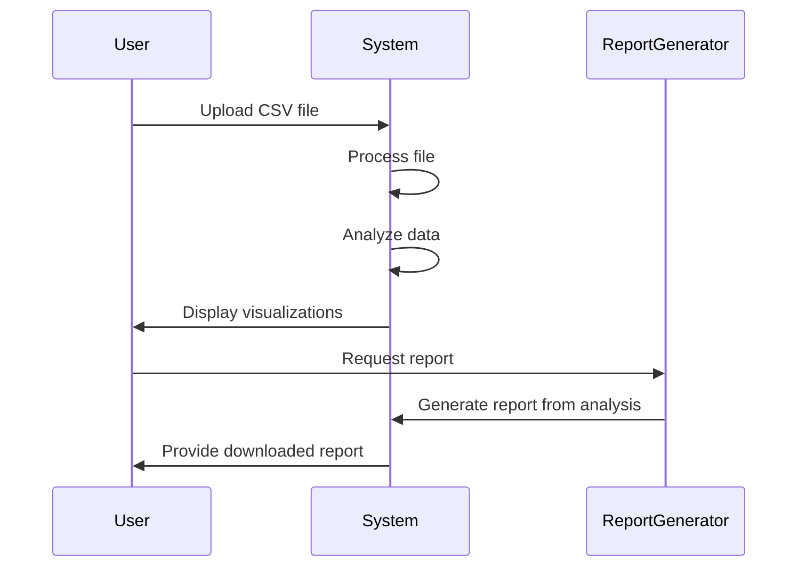

Hey! I see you want to validate your requirement and create a user requirement document that includes user stories, a journey diagram, and a sequence diagram. You’re looking for everything in markdown format, specifically using Mermaid for the diagrams. Got it!

### User Requirement Document

#### User Stories

1. **As a user**, I want to upload a CSV file with property data so that I can analyze it easily.
2. **As a user**, I want to visualize the analysis results through charts and graphs, helping me understand property trends better.
3. **As a user**, I want to generate a report from the analyzed data so that I can share insights with others.
4. **As a user**, I want to save my reports for future reference, so I don’t have to redo the analysis.

#### User Journey Diagram

#### Sequence Diagram

### Explanation

- **User Stories**: These help clarify what users expect from the application. They keep us focused on user needs.
- **User Journey Diagram**: This visually maps out the steps a user takes when interacting with the system. It’s a great way to see the flow of actions and identify any gaps.
- **Sequence Diagram**: This outlines how the system components interact step by step, providing a clear view of the processes involved in analyzing the data and generating reports.

I chose these formats because they are straightforward and help visualize user interactions with the system. If you have any tweaks or additional details, feel free to share! 😊