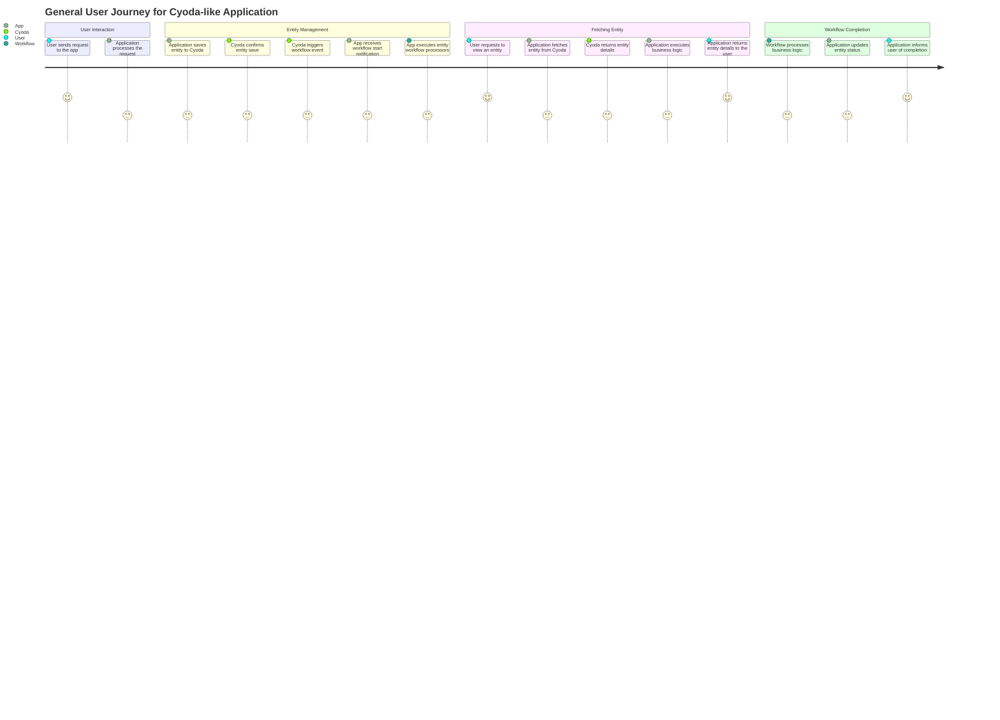
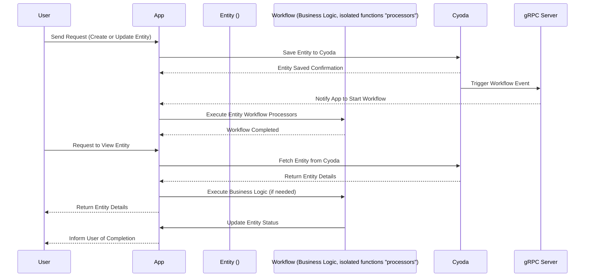

Your requirement for a Cyoda-like application is clear and well-structured! It efficiently outlines the user interactions, entity management, and workflow processes. Below is the **User Requirement Document** that includes user stories, a journey diagram, and a sequence diagram. 

### User Requirement Document for Cyoda-like Application

#### User Stories
1. **As a user**, I want to send a request to create or update an environment configuration so that I can manage my deployments.
2. **As a user**, I want to check the status of my deployment to ensure it is progressing correctly.
3. **As a user**, I want to view the details of my specific deployment to understand its configuration and current state.
4. **As a user**, I want to cancel a deployment if I determine it is no longer needed.

#### General User Journey for a Cyoda-like Application

#### General Sequence Diagram for a Cyoda-like Application

### Explanation of Choices
- **User Stories**: These stories capture the core functionalities that users expect from the application, ensuring the focus remains on the user experience and objectives.
- **Journey Diagram**: This diagram visualizes the step-by-step interactions users will have with the application, helping to clarify the flow of data and events across different components.
- **Sequence Diagram**: The sequence diagram provides a detailed view of how different participants (User, App, Cyoda, Workflow, gRPC Server) interact with each other through various stages of a request and response cycle. It outlines the order of operations, making it easier to understand the application's workflows.

This comprehensive document should serve as a solid foundation for further development and enhance communication across the team involved in building the application. If you have further requirements or adjustments, feel free to ask!