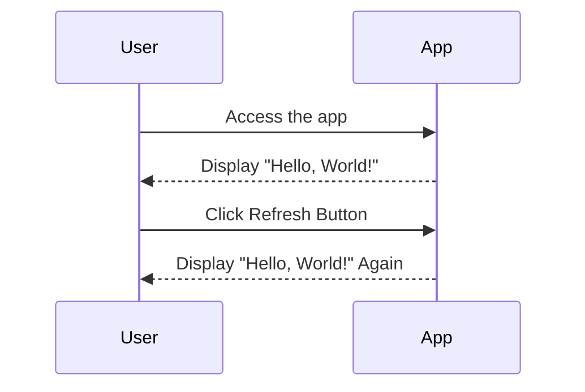

I understand that you want to validate your requirement for the "Hello, World!" application and create a user requirement document that includes user stories, a journey diagram, and a sequence diagram. This will help us clearly define how users interact with the app and how the app processes their requests.

### User Requirement Document for "Hello, World!" App

#### User Stories

1. **User Story 1**: As a user, I want to see a "Hello, World!" message when I access the app, so I know it's working correctly.
  
2. **User Story 2**: As a user, I want to click a button that refreshes the message, so I can see it again or see variations if we decide to expand later.

#### User Journey Diagram

Here’s a simple user journey for the app:

```mermaid
graph TD;
    A[User Accesses App] --> B[View "Hello, World!"];
    B --> C[Click Refresh Button];
    C --> B;
```

This diagram shows how the user starts by accessing the app, views the message, and can refresh to see it again.

#### Sequence Diagram

Here's a sequence diagram to illustrate the interaction process:



This diagram represents the steps involved when the user interacts with the app. They access the app, see the message, and can refresh it.

### Explanation of Choices

- **User Stories**: I chose these stories to keep it simple and focused on the core functionality of the app.
- **Journey and Sequence Diagrams**: These diagrams visually represent how the user interacts with the app, making it easier to understand the flow without getting too technical.

Feel free to share any thoughts or additional details, and we can refine this further together! If there’s anything more specific you want to add or clarify, just let me know!