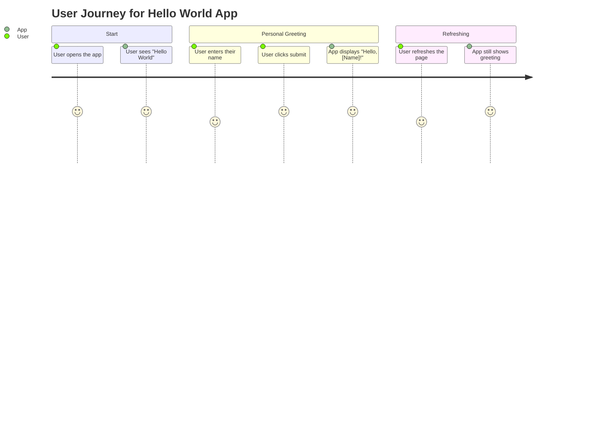
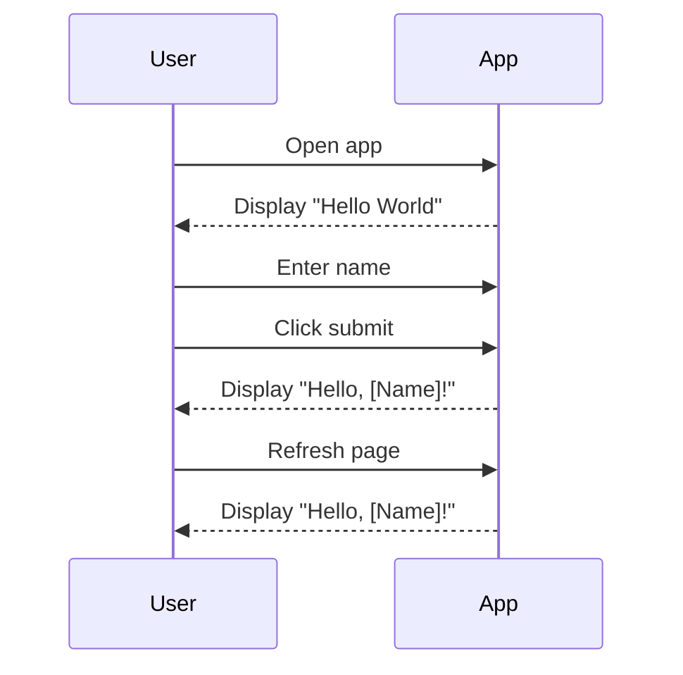

I understand that you want to validate your requirement for the "Hello World" application and create a user requirement document that includes user stories, a journey diagram, and a sequence diagram. This is a smart move because it helps clarify what you want the app to do from a user's perspective.

Here’s how I suggest structuring the user requirement document:

### User Requirement Document for Hello World App

#### User Stories

1. **As a user, I want to see "Hello World" when I visit the app, so I know the app is working.**
   - Acceptance Criteria: The app must display "Hello World" on the homepage.

2. **As a user, I want to enter my name and receive a personalized greeting, so I feel welcomed.**
   - Acceptance Criteria: When I input my name and click submit, the app should respond with "Hello, [Name]!"

3. **As a user, I want to be able to refresh the page without losing my greeting, so I can see it again easily.**
   - Acceptance Criteria: The greeting should persist after refreshing.

#### User Journey Diagram

#### Sequence Diagram

### Explanation of Choices

- **User Stories:** These help clarify what features the app should have, focusing on user needs. They keep things user-centric and ensure the app is built for real people.

- **Journey Diagram:** This visualizes the steps a user takes when interacting with your app. It’s simple but effective for understanding the user experience.

- **Sequence Diagram:** This outlines how the app will respond to user actions over time, showing the interaction between the user and the app.

What do you think? Would you like to add or change anything? Let me know if you have any files or additional thoughts to share!