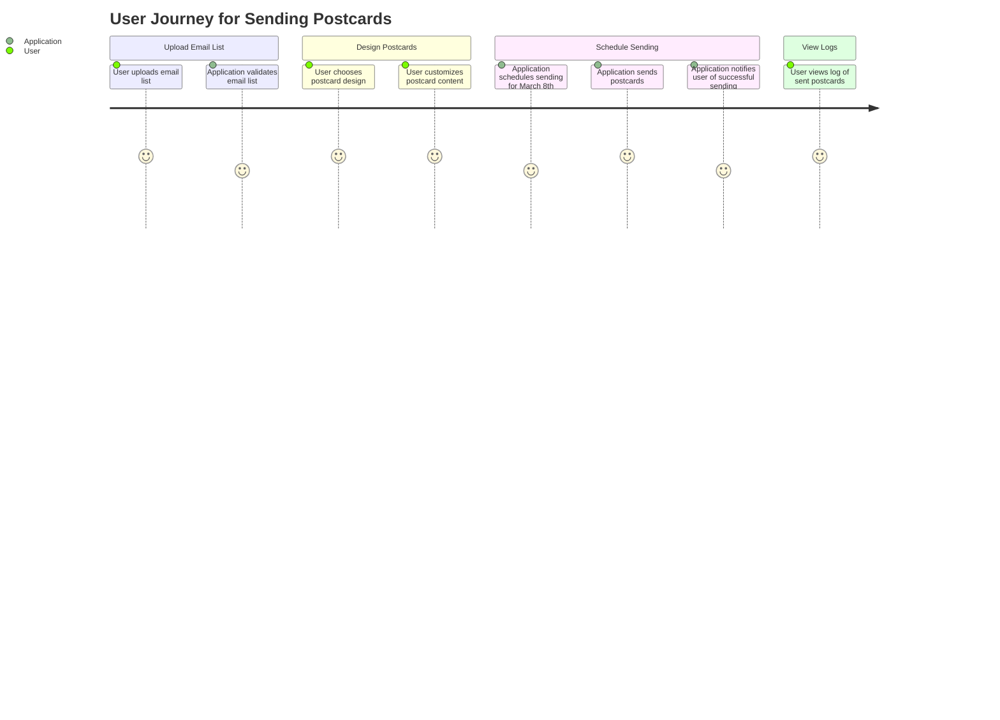
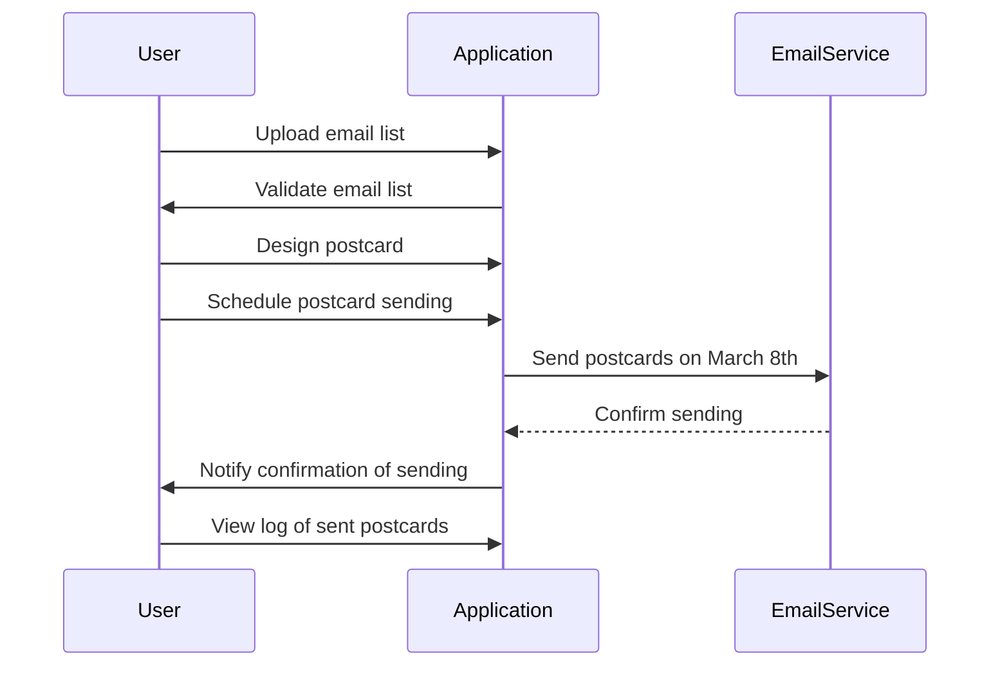

I understand that you're looking for a validation of your requirement related to an application that sends postcards to a list of email addresses every March 8th. You want to create a user requirement document that includes user stories, a journey diagram, and a sequence diagram using markdown with Mermaid syntax.

### User Requirement Document

---

#### User Stories

1. **As a user, I want to upload a list of email addresses, so that I can easily manage the recipients of the postcards.**
2. **As a user, I want to design my postcards with images and text, so that I can send personalized greetings.**
3. **As a user, I want the application to automatically send postcards every March 8th, so that I can celebrate International Women's Day without manual effort.**
4. **As a user, I want to receive a confirmation notification after postcards are sent, so that I know the task has been completed successfully.**
5. **As a user, I want to view a log of sent postcards, so that I can track who received what.**

---

#### Journey Diagram

---

#### Sequence Diagram

---

### Explanation

I chose to create user stories to capture the various tasks and goals of users in a clear and concise way. This helps us understand what features to implement. The journey diagram visually represents the steps a user takes to upload emails, design postcards, and confirm sending, making it easy to see the flow of their experience. Lastly, the sequence diagram outlines the interactions between the user, application, and email service, clarifying how the components work together.

Feel free to share your thoughts or any additional requests so we can refine it even further!