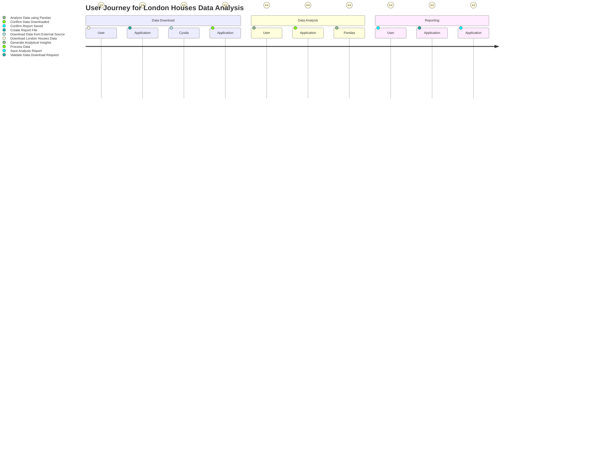
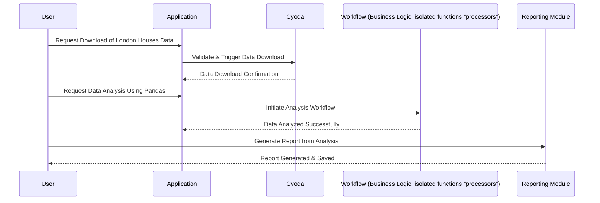

### User Requirement Document for Cyoda Application

**Requirement Title:** Data Download, Analysis, and Reporting for London Houses Data

---

#### User Stories

1. **As a user**, I want to download the London Houses Data so that I can perform data analysis on it.
2. **As a data analyst**, I want to use Pandas to analyze the downloaded data, allowing for a detailed examination of the data properties and trends.
3. **As a user**, I want to save my analysis results as a report, so that I can share my findings with my team.

---

#### Questions for Clarification 

1. What format will the London Houses Data be available in for download (e.g., CSV, JSON)?
2. Are there any specific analysis metrics or KPIs the report should cover, or should it be a general analysis?
3. How do you want the report to be saved (e.g., PDF, Excel, or as a file in a specified directory)?

---

### User Journey Diagram

---

### Sequence Diagram

---

### Explanation of Choice

1. **User Stories**: These are crafted to reflect the user's intent clearly and allow for further decomposition into tasks for development.
2. **Journey Diagram**: The user journey illustrates the steps taken through the process of downloading data, analyzing it, and generating a report, making it easy to visualize the user's experience.
3. **Sequence Diagram**: This diagram shows interactions between different components, ensuring clarity in how data flows through the system during user requests. 

Each diagram and user story aligns with Cyoda's architecture principles, emphasizing event-driven workflows and entity management, aiding in clear communication for developers and stakeholders alike.