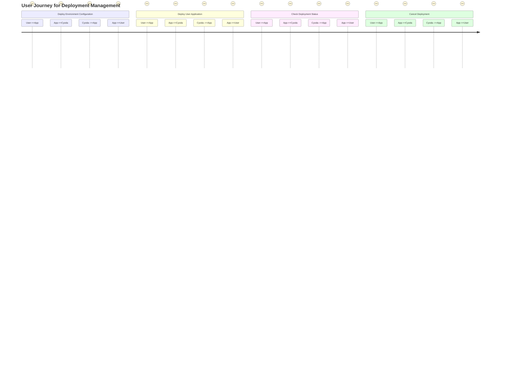
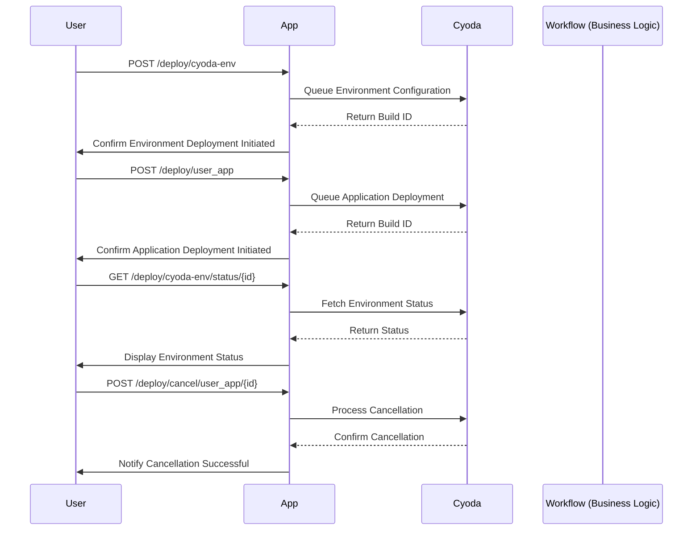

Here’s the validated user requirement document, incorporating user stories, journey diagram, and sequence diagram tailored specifically for your application managing deployment and environment configuration in the context of a Cyoda-like architecture.

---

# User Requirements Document

## User Stories

1. **User Story 1: Deploy Environment Configuration**
   - **As a** user,
   - **I want to** deploy a configuration for my environment,
   - **So that** I can set up my resources correctly for the application.

2. **User Story 2: Deploy User Application**
   - **As a** user,
   - **I want to** deploy my application using a specified repository URL,
   - **So that** my application is available to users.

3. **User Story 3: Check Deployment Status**
   - **As a** user,
   - **I want to** check the status of my environment and application deployments,
   - **So that** I can monitor the progress and troubleshoot if necessary.

4. **User Story 4: Cancel Deployment**
   - **As a** user,
   - **I want to** cancel a deployment if it is no longer needed,
   - **So that** I can avoid unnecessary resource usage.

## User Journey Diagram

## Sequence Diagram

## Explanation of Choices

1. **User Stories**: The user stories outline the tasks from the user's perspective, ensuring the functionalities are user-centric and address real needs.

2. **User Journey Diagram**: This diagram visually represents the steps a user takes while interacting with the application, from initiating deployments to checking statuses, thus helping to clarify user interactions.

3. **Sequence Diagram**: The sequence diagram shows the flow of actions among the user, the application, and Cyoda’s system. It helps in understanding the order of operations and how data moves through the system, ensuring clarity in implementation.

These diagrams and stories ensure that the application aligns with user needs and Cyoda's event-driven architecture, creating a comprehensive view of the application’s functionalities. If you have any further adjustments or additions, feel free to let me know!