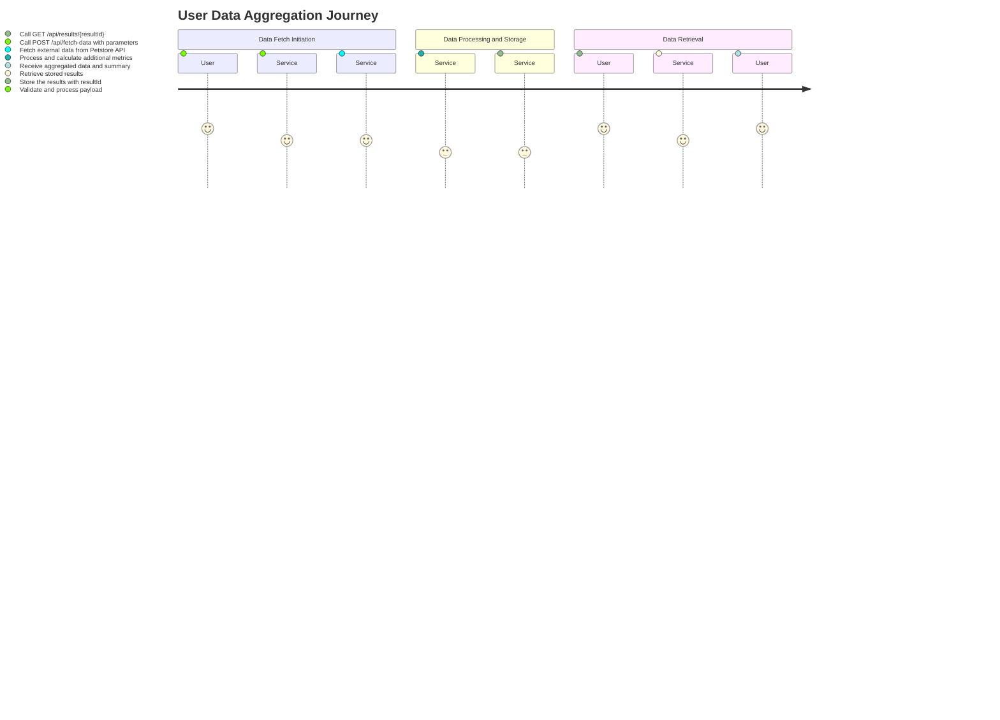
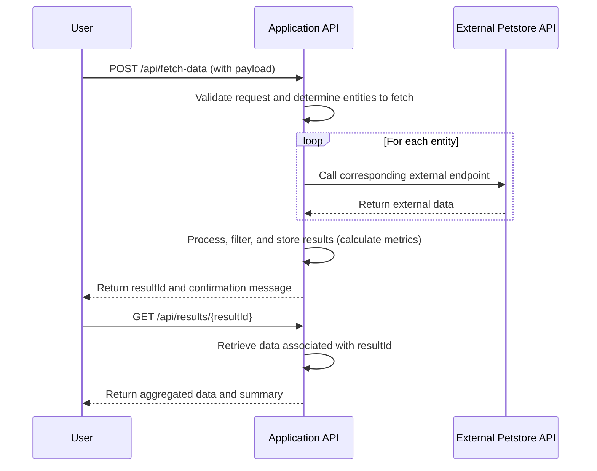

# Functional Requirements for Petstore Data Aggregation Project

## Overview

This project aims to aggregate data from the external Petstore API (https://petstore.swagger.io/v2/swagger.json) and provide processed results through a RESTful internal API. The architecture follows best practices for RESTful API design by separating data fetching logic from data retrieval.

## API Endpoints

### 1. POST /api/fetch-data

- **Purpose:**  
  Initiates the process of fetching and processing external data from the Petstore API.

- **Request Format:**  
  Content-Type: `application/json`  
  ```json
  {
    "entities": ["pets", "orders", "users"], 
    "filter": {
      "status": "available",
      "dateRange": {
        "from": "2023-01-01",
        "to": "2023-12-31"
      }
    }
  }
  ```
  - `entities`: An array specifying which categories of data to fetch (e.g., "pets", "orders", "users"). If omitted, all entities are fetched.
  - `filter`: An optional object that defines filtering criteria, such as pet status or date range for orders.

- **Response Format:**  
  Content-Type: `application/json`  
  ```json
  {
    "resultId": "abc123",
    "message": "Data fetch initiated successfully.",
    "fetchedEntities": ["pets", "orders", "users"]
  }
  ```
  - `resultId`: A unique identifier for the fetched result set.
  - `message`: A confirmation message indicating the success of the operation.
  - `fetchedEntities`: An array that echoes the entities that were processed.

- **Business Logic:**  
  - Validate the request payload.
  - Call the relevant external endpoints of the Petstore API to fetch data.
  - Process and compute additional metrics if required.
  - Store the processed results (or cache them) with the associated `resultId`.

### 2. GET /api/results/{resultId}

- **Purpose:**  
  Retrieves previously fetched and processed data using the `resultId` generated from the POST call to `/api/fetch-data`.

- **Request Format:**  
  - URL Parameter: `resultId`
  - No request body.

- **Response Format:**  
  Content-Type: `application/json`  
  ```json
  {
    "resultId": "abc123",
    "timestamp": "2023-10-10T12:00:00Z",
    "data": {
      "pets": [
        /* Array of pet objects */
      ],
      "orders": [
        /* Array of order objects */
      ],
      "users": [
        /* Array of user objects */
      ]
    },
    "summary": {
      "petCount": 150,
      "orderCount": 45,
      "userCount": 20
    }
  }
  ```
  - `data`: Contains arrays of data objects for each requested entity.
  - `summary`: Provides aggregate metrics computed during the fetch process.

## User Journey Diagram



## Sequence Diagram



This document outlines the functional requirements for your project, including necessary API endpoints, request/response formats, and visual representations of user interactions and system sequences.